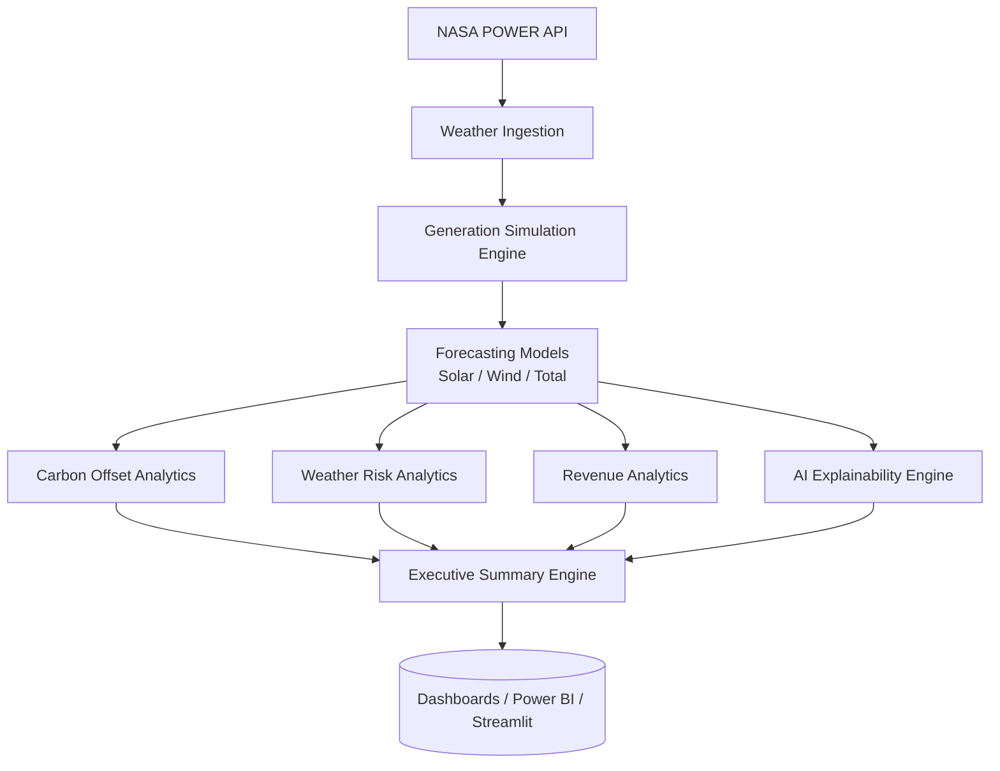

<div align="center">

# ⚡ AI-Powered Renewable Energy Digital Twin
**Khavda Renewable Energy Park | End-to-End Market Intelligence Platform**

[](https://www.python.org/)
[]()
[]()
[]()
[]()

</div>

---

## 📖 Project Overview

This project is a comprehensive **End-to-End Renewable Energy Intelligence Platform** built entirely in Python. By leveraging real-world weather observations from the NASA POWER API, this digital twin simulates, forecasts, and financially evaluates the energy output of the Khavda Renewable Energy Park. 

The platform bridges the gap between atmospheric science and energy economics by successfully executing:
* **Weather Condition Analysis**
* **Simulated Renewable Generation**
* **Solar & Wind Generation Forecasting**
* **Total Renewable Output Forecasting**
* **Carbon Offset & Sustainability Estimation**
* **Weather Risk Analytics**
* **Financial Revenue Generation Analytics**
* **AI Model Behavior Explainability**
* **Automated Executive Business Summaries**

---

## 🛠️ Tech Stack

| Category | Technologies |
| :--- | :--- |
| **Core Programming** | Python |
| **Data Engineering** | Pandas, NumPy |
| **Machine Learning** | XGBoost, Scikit-Learn |
| **Data Visualization**| Matplotlib |
| **Version Control** | GitHub |
| **Data Storage** | PostgreSQL *(Planned)* |
| **BI & Dashboards** | Power BI, Streamlit *(Planned)* |

---

## 🏗️ Project Architecture



---

## 📦 Modules 

### 1. Weather Ingestion (`weather_api.py`)
* **Purpose:** Fetches automated meteorological data for the target coordinate from the NASA POWER API.
* **Inputs:** Latitude, Longitude, Date Ranges.
* **Outputs:** Cleaned historical weather dataset.
* **Business Value:** Provides the raw operational ground-truth required for forecasting.

### 2. Generation Simulation Engine (`generate_renewable_generation.py`)
* **Purpose:** Synthesizes realistic MW generation figures utilizing a Physics-Informed engine (`pvlib`) for solar and advanced aerodynamic models for wind.
* **Inputs:** Raw weather data (Radiation, Wind Speed, Temperature).
* **Outputs:** Physics-enriched generation dataset (Effective Irradiance, Cell Temp, PR).
* **Business Value:** Provides an engineering-grade theoretical baseline to compare against actual SCADA output.

### 3. Solar Forecast Model (`solar_model.py`)
* **Purpose:** Predicts solar generation utilizing engineered temporal variables and radiation metrics.
* **Inputs:** Processed weather and historical solar generation data.
* **Outputs:** Solar generation forecasts, evaluation metrics, and predictive plots.
* **Business Value:** Enables day-ahead grid scheduling and load balancing.

### 4. Wind Forecast Model (`wind_model.py`)
* **Purpose:** Predicts wind generation based on aerodynamic variables like wind speed and air density proxy factors.
* **Inputs:** Processed weather and historical wind generation data.
* **Outputs:** Wind generation forecasts, evaluation metrics, and feature importance matrices.
* **Business Value:** Mitigates the volatility risk inherent in wind generation.

### 5. Total Output Forecast Model (`total_output_model.py`)
* **Purpose:** Consolidates the site's overall blended renewable output capacity without target leakage.
* **Inputs:** Base weather features and temporal data.
* **Outputs:** Consolidated MW forecasting.
* **Business Value:** Provides a top-line operational target for executive dispatch teams.

### 6. Carbon Offset Analytics (`carbon_offset.py`)
* **Purpose:** Translates clean megawatt hours into standard sustainability metrics.
* **Inputs:** Forecasted and simulated generation data.
* **Outputs:** CO₂ Avoided, Coal Saved, Trees Equivalent.
* **Business Value:** Supports ESG reporting and carbon credit monetization.

### 7. Weather Risk Analytics (`weather_risk.py`)
* **Purpose:** Categorizes extreme weather anomalies (Heatwaves, Dust Storms, Cloud Curtailment) impacting operations.
* **Inputs:** Weather data.
* **Outputs:** High/Medium/Low risk classifications and alerts.
* **Business Value:** Acts as an early warning system to protect physical panel/turbine assets.

### 8. Revenue Analytics (`revenue_analytics.py`)
* **Purpose:** Maps energy generation to financial benchmarks while factoring in weather-related revenue at risk.
* **Inputs:** Generation data, weather risk multipliers.
* **Outputs:** Expected INR revenue and Revenue-at-Risk tracking.
* **Business Value:** Translates engineering metrics into CFO-ready financial projections.

### 9. AI Explainability Engine (`model_explainability.py`)
* **Purpose:** Demystifies the "black box" forecasting models by dynamically interpreting dominant features.
* **Inputs:** Feature importance matrices across all sub-models.
* **Outputs:** Plain-English dynamic insights (e.g., *"Cloud cover will reduce solar generation"*).
* **Business Value:** Builds stakeholder trust in AI decision-making.

### 10. Grid Intelligence & DSM Analytics (`nldc_grid_scraper.py`)
* **Purpose:** Connects to the National Load Despatch Centre (NLDC) to monitor live grid frequency.
* **Inputs:** NLDC live telemetry data.
* **Outputs:** Grid frequency profiles and Deviation Settlement Mechanism (DSM) penalty simulations.
* **Business Value:** Protects the company from severe regulatory fines during grid instability by recommending real-time dispatch adjustments.

### 11. Executive Summary Engine (`executive_summary.py`)
* **Purpose:** Stitches all decentralized pipelines into one finalized intelligence layer.
* **Inputs:** Outputs from all previous modules.
* **Outputs:** A flattened, BI-ready master dataset and automated textual executive narratives.
* **Business Value:** Feeds enterprise dashboards directly, requiring zero manual analyst intervention.

---

## 🏆 Key Results

Our machine learning and analytics layer achieved phenomenal results on the holdout test data:

| Metric / KPI | Value |
| :--- | :--- |
| **Solar Forecast R²** | `0.9991` |
| **Wind Forecast R²** | `0.9983` |
| **Total Output Forecast R²** | `0.9962` |
| **Total CO₂ Avoided** | `181,404 Tons` |
| **Total Coal Saved** | `110,612 Tons` |
| **Trees Equivalent** | `8.25 Million` |
| **Critical Risk Days** | `4` |
| **Weather Warning Days** | `38` |

---

## 📂 Project Structure

```text
energy-market-intelligence-platform/
├── data/
│   ├── raw/
│   └── processed/
├── reports/
│   ├── carbon_offset/
│   ├── executive/
│   ├── explainability/
│   ├── solar/
│   ├── total_output/
│   ├── weather/
│   └── wind/
├── models/
├── database/
├── docs/
├── src/
│   ├── ingestion/
│   ├── forecasting/
│   ├── analytics/
│   └── database/
├── requirements.txt
└── README.md
```

---

## 💼 Business Impact

* **Renewable Energy Forecasting:** Dramatically reduces scheduling deviation penalties by providing ultra-accurate day-ahead generation expectations.
* **Sustainability Analytics:** Automates the quantification of ESG metrics, making carbon credit auditing instantaneous.
* **Carbon Reduction Monitoring:** Visually tracks the real-world impact of the facility against fossil fuel benchmarks.
* **Revenue Intelligence:** Translates raw engineering data (MW) directly into financial metrics (INR), aligning the engineering and finance departments.
* **Operational Risk Management:** Prevents costly operational blindspots by quantifying the exact financial exposure to upcoming heatwaves and dust storms.
* **Explainable AI:** Ensures grid operators understand *why* the AI is predicting a drop in power, preventing automated system mistrust.

---

## 🚀 Future Roadmap (Phase 2)

- [ ] **PostgreSQL Integration:** Migrate flat-file outputs into a structured, relational data warehouse.
- [x] **Streamlit Dashboard:** Deploy an interactive, web-based tool for operational engineers.
- [ ] **Power BI Dashboard:** Build executive-level financial and sustainability visual reports.
- [x] **SHAP Explainability:** Deepen the AI Explainability engine utilizing mathematically rigorous Shapley values.
- [ ] **Real-Time Forecasting:** Connect to live telemetry APIs rather than static historical batches.
- [x] **IEX Market Integration:** Pull live market clearing prices from the Indian Energy Exchange to dynamically optimize revenue.
- [x] **Grid Compliance:** Integrate NLDC grid frequency monitoring to proactively avoid DSM penalties.

---

## 📄 Resume Section

*(ATS-Friendly bullet points for Data Professionals)*

* Architected an end-to-end AI-powered Digital Twin for a Renewable Energy Park using Python, Pandas, and XGBoost to simulate and forecast grid-scale energy generation.
* Developed highly accurate ensemble forecasting pipelines predicting solar and wind output, achieving an impressive R² score of 0.99+ across all operational models.
* Engineered a Revenue and Risk Analytics engine that quantified weather-related generation threats, directly mapping meteorological anomalies to financial revenue-at-risk.
* Designed an automated AI Explainability and Executive Summary layer that translated complex machine learning feature importance into plain-English business insights for C-suite stakeholders.
* Operationalized sustainability pipelines calculating over 180,000 tons of avoided CO₂ emissions, preparing the overarching dataset for seamless Power BI and Streamlit integration.
